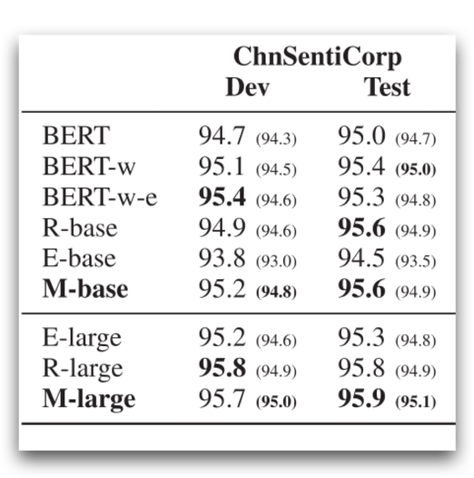

使用预训练模型处理情感分类
=======
本项目是数据集使用的是ChnSentiCorp情感分类数据集。
项目的目的是为了验证MacBERT模型的有效性。[论文链接](https://ieeexplore.ieee.org/document/9599397)

实验方案如下表
----
|       微调模式       | 初始学习率 | scheduler | 最好的epoch | 验证集成绩 | 测试集成绩 |
|:----------------:|:-----:|:---------:|:--------:|:-----:|:-----:|
|       不冻结        | 2e-5  |   3，0.9   |    5     | 0.952 | 0.954 |
| 冻结word embedding | 2e-5  |   2，0.8   |    5     | 0.956 | 0.955 |
|  冻结所有embedding   | 2e-5  |   2，0.8   |    17    | 0.958 | 0.958 |
|       不冻结        | 1e-5  |   3，0.9   |    12    | 0.955 | 0.963 |
|    只解冻pooler     | 2e-5  |   2，0.8   |    6     | 0.883 | 0.890 |
|       不冻结        | 2e-5  |   2，0.8   |    2     | 0.949 | 0.953 |
| 冻结word embedding | 2e-5  |   2，0.8   |    3     | 0.946 | 0.944 |

> 原作者训练成绩
> ---
> 